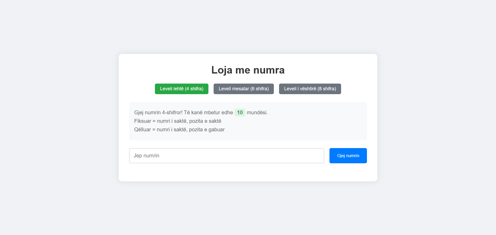
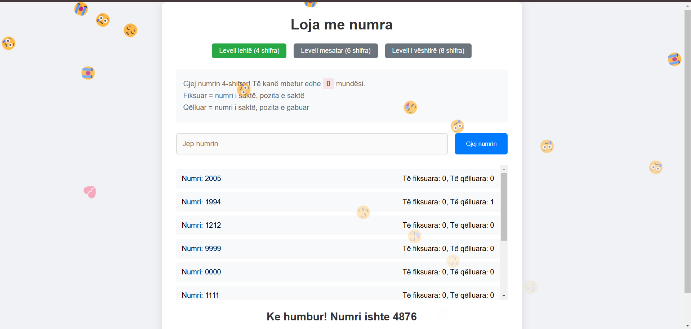

# Loja e numrave (Bulls and Cows based game)

A fun and challenging number guessing game where players try to guess a secret number using feedback in the form of fiksuar (correct digit in correct position) and qëlluar (correct digit in wrong position).

## Game Features

- Three difficulty levels:
  - Easy (4 digits)
  - Medium (6 digits)
  - Hard (8 digits)
- Visual feedback for remaining guesses
- Celebration animations for winning
- Responsive design
- Keyboard support (Enter key to submit)

## Screenshots

### Game Interface

### Winning Celebration

### Game Over

## How to Play

1. Choose your difficulty level (Easy, Medium, or Hard)
2. Enter your guess in the input field
3. Click "Submit" or press Enter
4. Get feedback:
   - Të fiksuara: Correct digit in correct position
   - Të qëlluara: Correct digit in wrong position
5. Use the feedback to make your next guess
6. Try to guess the number before running out of attempts!

## Technologies Used

- HTML5
- CSS3
- JavaScript
- Confetti.js for celebrations

## Getting Started

1. Clone the repository
2. Open the index.html file in your browser 
3. Enjoy the game!
